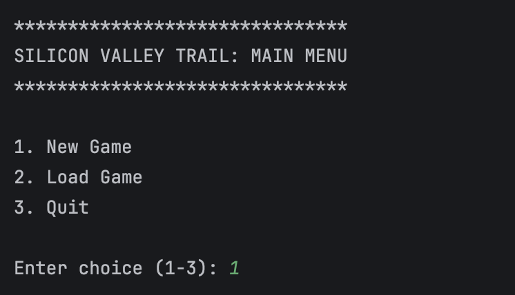
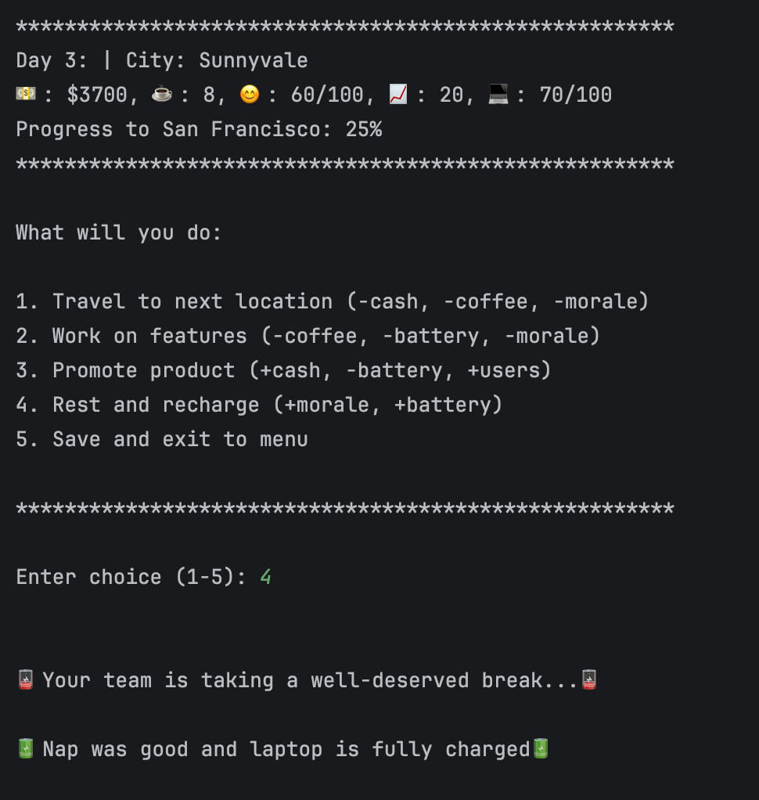
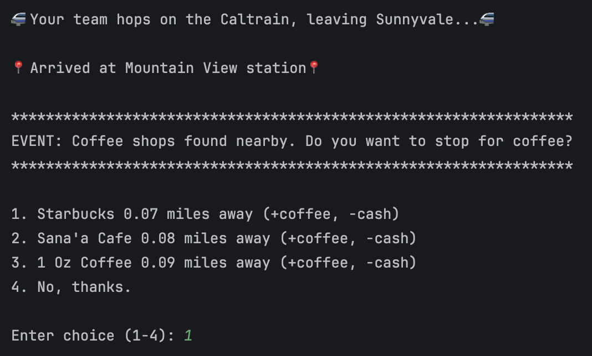

# 🌉 Silicon Valley Trail 

A Java-based simulation game inspired by The Oregon Trail. Players navigate from San Jose to San Francisco while managing resources, and making strategic decisions.

Players must manage the following resources:
- **💰 Cash**
- **☕ Coffee**
- **😊 Team Morale**
- **📈 Daily Active Users**
- **🔋 Laptop Battery**

---

## Quick Start
### Prerequisites
- Java 17+
- Maven

## Setup
1. Clone the repository:
```bash
git clone https://github.com/ChristianaRazafindrasoa/silicon-valley-trail.git
cd silicon-valley-trail
```

2. Copy file:
```bash
cp .env.example .env
```

3. Configure environment variable:
```dotenv
MAPBOX_SECRET_KEY=YOUR_KEY_HERE
```
Get your secret access token here: https://www.mapbox.com

## Running the App
```bash
mvn clean compile exec:java
```

## Testing
Run tests using:
```bash
mvn test
```

## Example commands/inputs
<div style="text-align: left;">
    <h3>Main Menu</h3>
    <br><br>
    <h3>Game Menu</h3>
    <br><br>
    <h3>Event Menu</h3>
    <br>
</div>

## AI Usage
AI tools were used to assist with:
- API integration
- Proof-reading

---

# Design Notes

## Game Loop
1. Start the day
2. Choose an action (search, explore, rest, etc.)
3. Consume or reload resources
4. Trigger random events if traveling
5. Update state
6. Repeat until success or failure

## API Integration
- Uses Mapbox Search API for location-based queries
- Affects gameplay by getting nearest coffee shops to choose from to replenish coffee

## Error Handling
The game handles:
- Network failures
- Missing API keys
- Empty responses
- Rate limits

If API calls fail:
- The app continues running on mock data
- Errors are handled gracefully
- Gameplay proceeds without crashing 

## Future Improvements
- Add UI (web or mobile)
- More random events
- Smarter resource balancing
- Additional APIs (e.g., Yelp, OpenAI)


